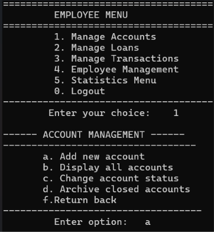

# Bank Management System (C++)

A console-based Bank Management System developed in C++ .

## Features
- Create customer accounts
- Deposit and withdraw money
- Manage customer information
- Employee account management
- Console-based interface
- File handling for data storage

## Technologies Used
- C++
- File Handling
- Visual Studio

## Project Structure
- `.h` files → Stuct declarations
- `.cpp` files → implementation
- Separate modules for customers and employees

## What I Learned
Through this project, I improved my understanding of:
- Structs
- Modular programming
- File organization in C++
- Basic banking system logic

## How to Run
1. Open the project in Visual Studio
2. Compile the solution
3. Run the executable

## Future Improvements
- Add authentication system
- Improve UI design
- Add database integration
- Enhance security features

## Screenshots

### Main Menu

### Employee Menu

## Author
Zeyneb Ben Hamouda , Sirine Kefif , Hiba Yahyaoui , Med Aziz Ahmed
First-year Digital Engineering Student – HIDE
